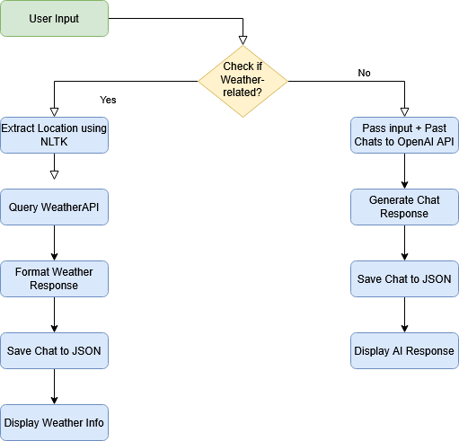

# AI Chatbot with Weather Integration

A Python-based chatbot that combines OpenAI's GPT models with weather information capabilities. The chatbot can handle general conversations and provide weather information for specific locations.

## 📊 System Workflow



## Features

- General conversation using OpenAI's GPT models
- Weather information lookup for any location
- Context-aware conversations using chat history
- Automatic saving of chat history in JSON format
- Error logging functionality
- Named Entity Recognition for location detection

## Prerequisites

- Python 3.7 or higher
- OpenAI API key
- WeatherAPI.com API key

## Installation

1. Clone the repository:
```bash
git clone <your-repository-url>
cd <repository-name>
```

2. Install the required dependencies:
```bash
pip install -r requirements.txt
```

3. Create a `.env` file in the root directory with your API keys:
```
OPENAI_API_KEY=your_openai_api_key
WEATHER_API_KEY=your_weatherapi_key
```

## Usage

1. Run the chatbot:
```bash
python chatbot.py
```

2. The chatbot will process the test cases defined in the script, which include:
   - Weather Location-based queries
   - General AI-related questions

## Project Structure

- `chatbot.py`: Main chatbot implementation
- `chat_history.json`: Stores conversation history
- `errorLog.txt`: Logs any errors that occur during execution
- `requirements.txt`: Lists all project dependencies
- `.env`: Contains API keys (not tracked in git)

## Features in Detail

### Chat Functionality
- Uses OpenAI's GPT models for conversation
- Maintains context from previous conversations
- Configurable temperature and model selection

### Weather Integration
- Fetches real-time weather data using WeatherAPI
- Supports location detection using NLTK
- Provides temperature, wind speed, and air quality information

### Data Management
- Automatically saves chat history in JSON format
- Implements error logging for debugging
- Loads previous chat history for context

## Contributing

Feel free to submit issues and enhancement requests!

## License

This project is licensed under the MIT License - see the LICENSE file for details. 
